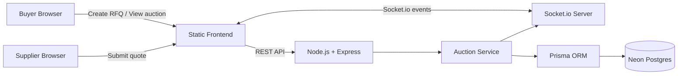

# British Auction RFQ - High Level Design

## Architecture

## Components

- Frontend: React + Vite app served by Express in production. It supports RFQ creation, auction listing, auction details, supplier bid submission, ranking, and activity viewing.
- API: Express routes under `/api/rfqs` handle auction creation, listing, detail retrieval, and bid submission.
- Auction Service: Owns validation, rank calculation, trigger evaluation, time extension, forced close capping, and activity logging.
- Realtime Layer: Socket.io notifies listing and detail pages when bids or extensions change an auction.
- Database: Neon Postgres accessed through Prisma.

## Auction Extension Flow

1. Supplier submits a bid.
2. Backend verifies the RFQ exists and status is `ACTIVE`.
3. Backend stores the bid and computes supplier ranking before and after the bid.
4. Backend checks whether the bid occurred within the trigger window.
5. Backend applies the configured trigger:
   - `BID_RECEIVED`
   - `ANY_RANK_CHANGE`
   - `L1_RANK_CHANGE`
6. If triggered, backend extends `currentBidCloseAt` by Y minutes.
7. Extension is capped at `forcedBidCloseAt`.
8. Backend writes activity logs and emits Socket.io updates.

## Deployment

- Render Web Service runs the backend with `npm start`.
- Render build command should install backend dependencies and generate Prisma client.
- Neon provides the Postgres `DATABASE_URL`.
- Prisma migrations are applied with `npm --prefix backend run prisma:deploy`.
